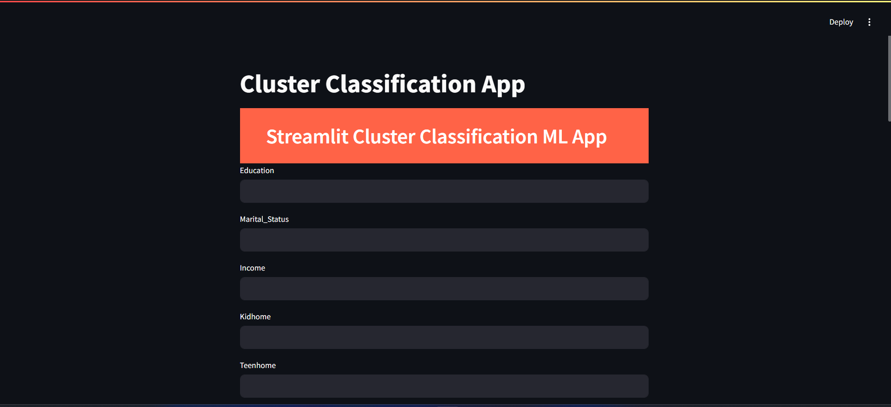

# Cluster Classification App 📊📈


## Overview

The Cluster Classification App is a user-friendly machine learning application built with Streamlit. 🤖 It leverages a pre-trained model to classify customer data into meaningful clusters, providing insights into customer behavior and segmentation. 📊 Whether you’re exploring customer characteristics or predicting responses, this app offers a straightforward interface to make informed decisions. 🚀




## Features

- **Predictive Power:** Uses a pre-trained machine learning model to classify customer data into clusters.
- **User-Friendly Interface:** Simple text inputs for customer attributes and an easy "Predict" button.
- **Data-Driven Insights:** Understand customer segments based on various characteristics.

## Technologies Used

- **Python**
- **Streamlit:** For building the web interface
- **Scikit-learn:** For machine learning model and preprocessing
- **NumPy & Pandas:** For handling data

## Setup and Installation

1. **Clone the repository:**

   ```bash
   git clone https://github.com/your-repo/cluster-classification-app.git
   cd cluster-classification-app

   ```

2. **Install the required packages:**

   ```bash
    pip install -r requirements.txt
   ```

3. **Download or place your pre-trained model files:**

Ensure you have the following files in the project directory:

- final_model.pkl
- scaler.pkl
- pca.pkl

 **Usage:**

1. Open the application in your web browser.
2. Enter customer attributes into the input fields.
3. Click the "Predict" button to see the predicted cluster.
4. Use the "About" button to learn more about the application.

## About

Welcome to the Streamlit Cluster Classification ML App! This application leverages a pre-trained machine learning model to classify customer data into meaningful clusters. Whether you’re exploring customer behavior, predicting responses, or segmenting your audience, this app provides insights at your fingertips.

**Key Features:**

- Predictive Power
- User-Friendly Interface
- Data-Driven Insights

Explore the app, uncover patterns, and enhance your decision-making process. Happy clustering!
